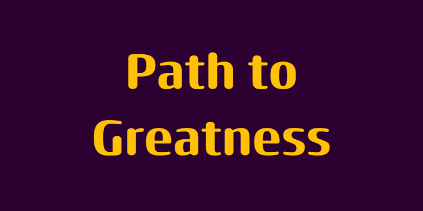
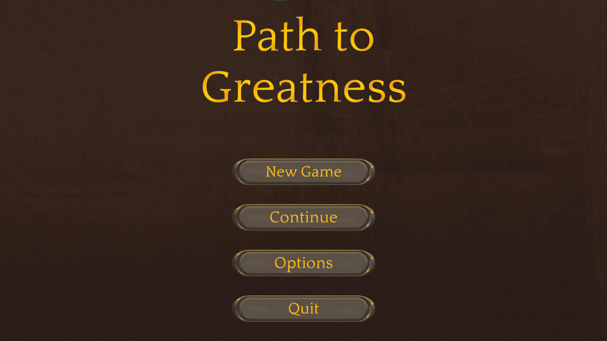
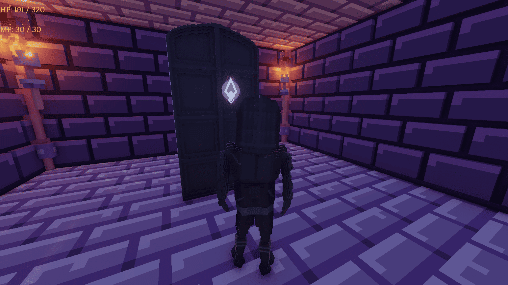
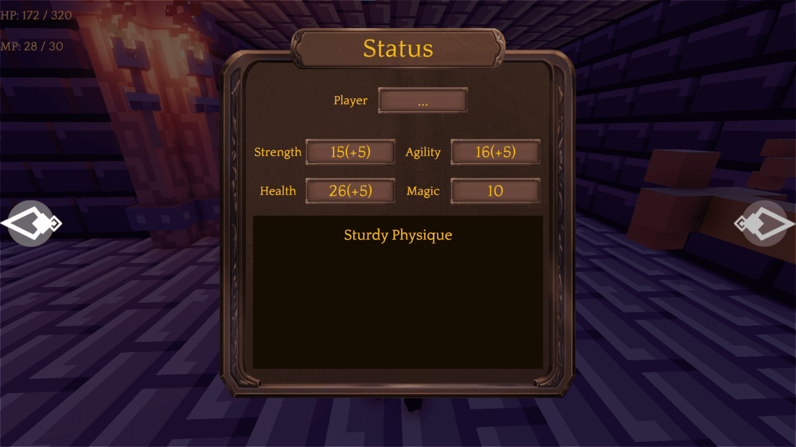
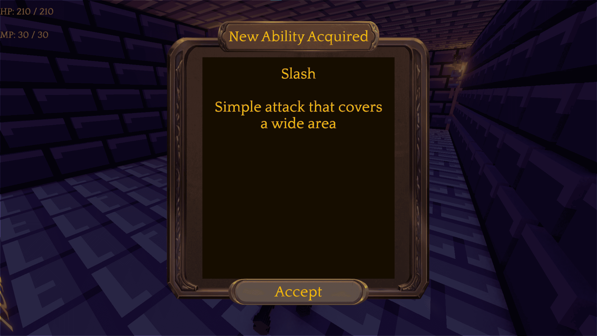
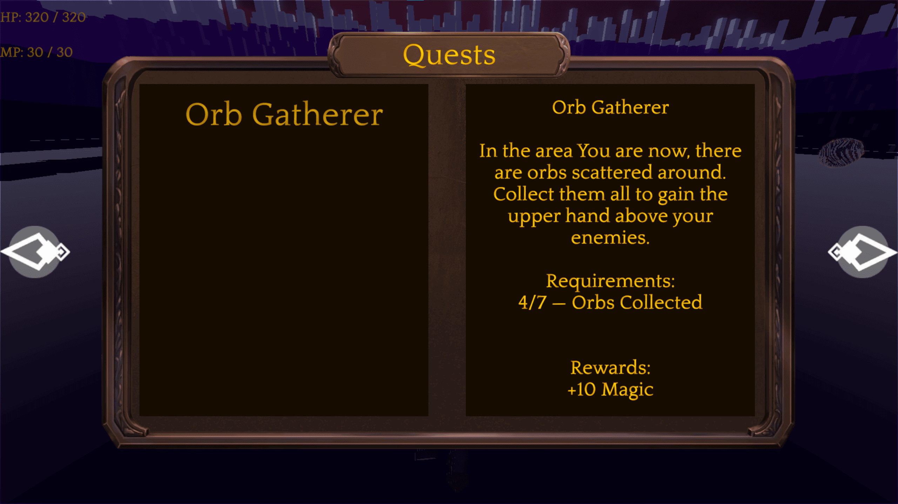

 
  

<h1 align="center"> Path to Greatness </h1>
<h3 align="center"> Bachelor of Engineering project for: <a href="https://www.polsl.pl/en/">Silesian University of Technology</a></h3>

<h2>About The Project</h2>

 
  This is the project for the Bachelor of Engineering degree at my university, Silesian University of Technology.

 
  It is a video game, combining multiple methods of level generation, from random dungeon generation to perlin noise terrain generation. It also features a unique Supervisor System that analyzes player's actions, grants rewards and punishments and controls the whole game flow.

 
  Supervisor System controls aspects such as player progression, stats, quests, abilities and much more.

<h2>Instalation</h2>

<h3>Project</h3>

- Clone the repository into your local machine
- Install the required Unity version
- Open the project

<h3>Release</h3>

- Download the release version
- Unpack the zip archive
- Launch the executable

<h2>Usage</h2>

- When the game is launched, players start in the main menu
- They can check out the graphics, audio and controls settings
- When they want to start the game, they press the New Game button and, if they have the save, press the Continue button

<h2>Gameplay Screenshots</h2>

  

  

  

  

  

